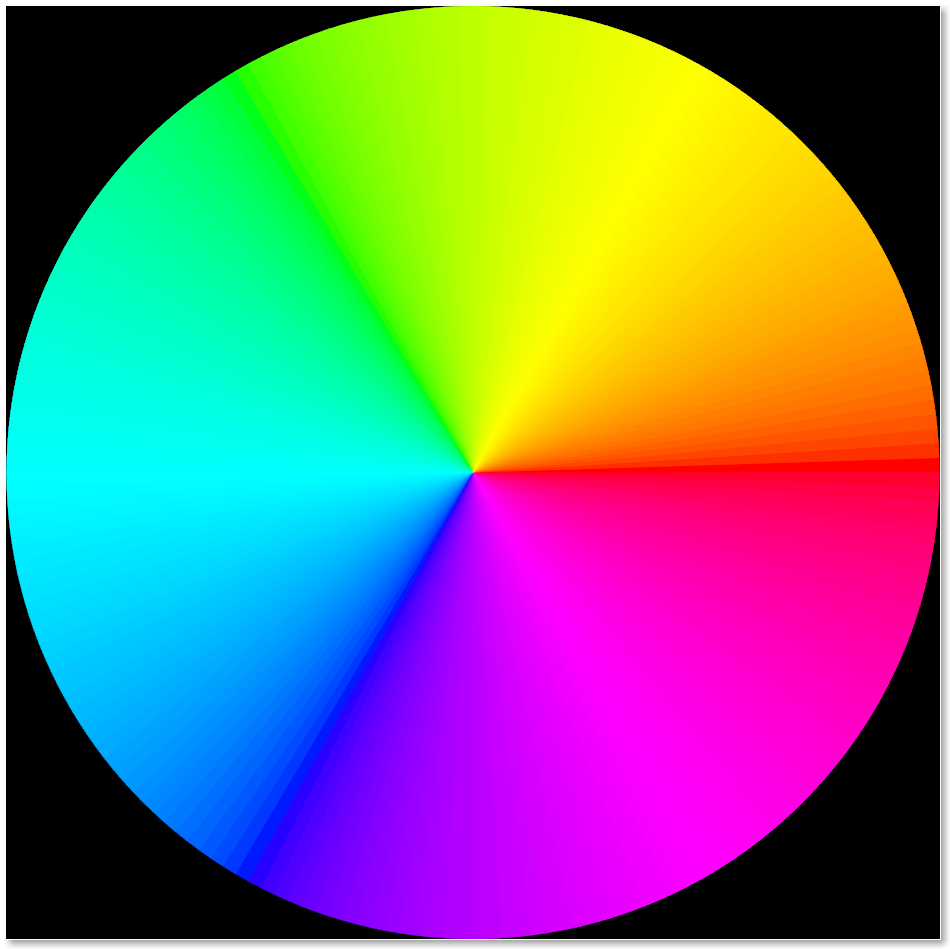
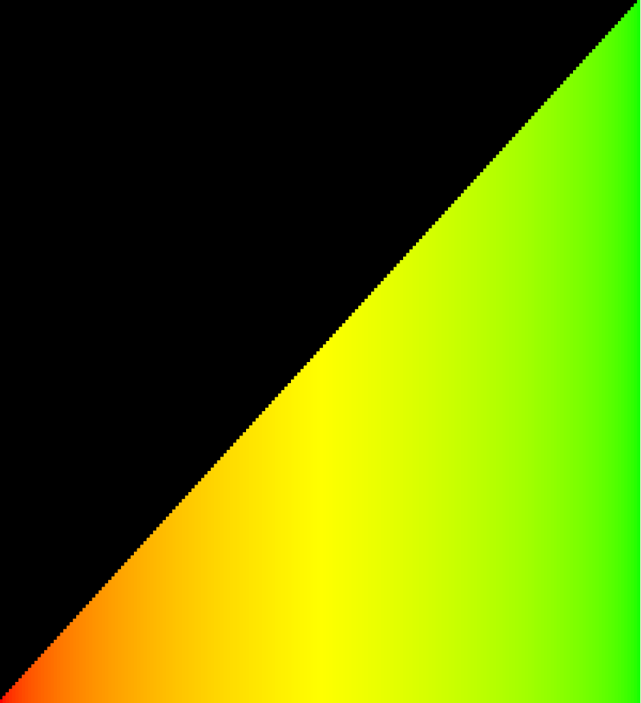
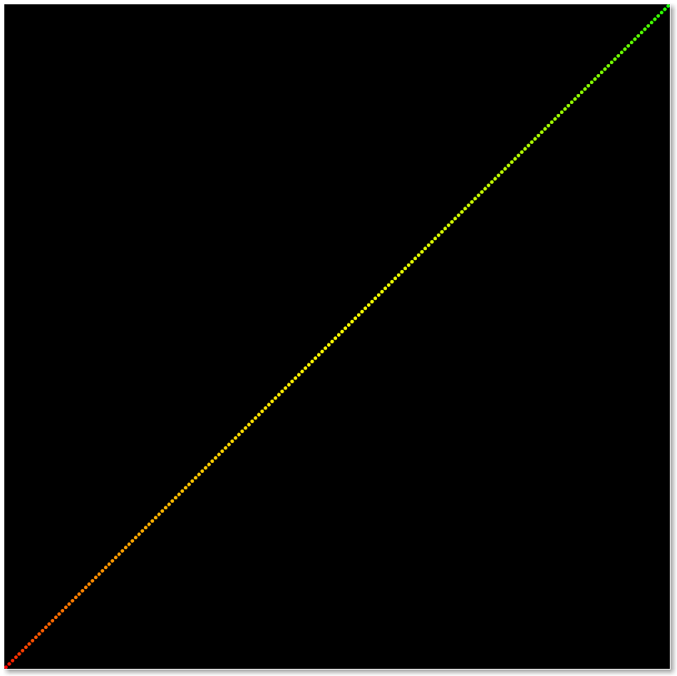
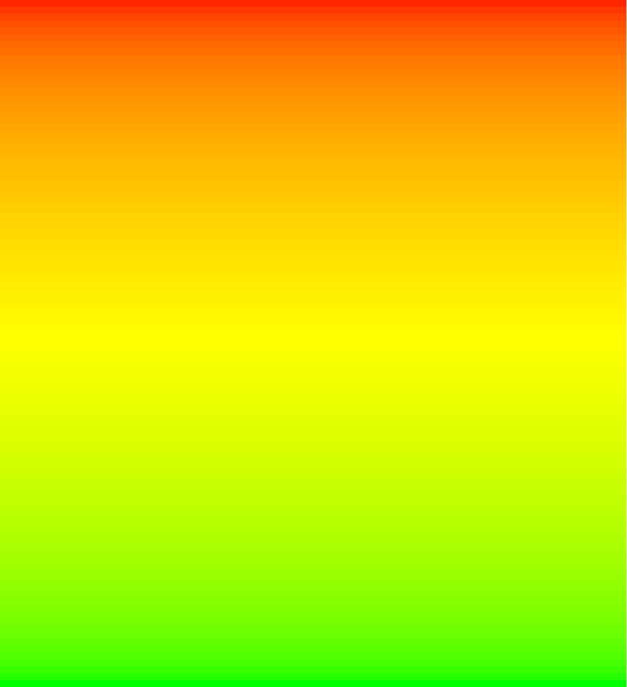
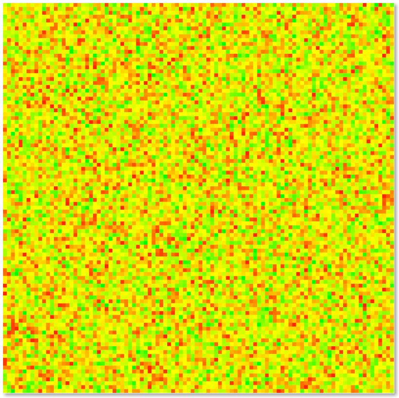

# Sorting Visualiser

### Visualisations:
#### Circle:

Displays array in a circle:

{:height="20%" width="20%"}

#### Bars:

Displays array as a row of bars:

{:height="20%" width="20%"}

#### Dots:

Displays array as dots:

{:height="20%" width="20%"}

#### Pixels:

Displays multiple arrays, spanning from the top to the bottom of the window. Each column of pixels is a seperate array.

{:height="20%" width="20%"}

{:height="20%" width="20%"}

### Controls:
#### Sorts:
**Key** | **Sort**
--- | ---
**1** | Bubble Sort.
**2** | Selection Sort.
**3** | Quick Sort.
**4** | Shell Sort.

#### Array functions:
**Key** | **Sort**
--- | ---
**S** | Shuffle.
**R** | Reset array.
**I** | Invert/reverse array.
**Q** | Cancel current sort.

#### Display modes:
**Key** | **Sort**
--- | ---
**C** | Circle.
**B** | Bars.
**D** | Dots.
**P** | Pixels.